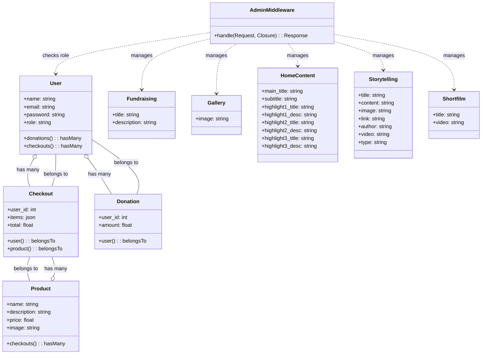

# Habi Heritage System Class Diagram

This class diagram represents the backend domain models of the Habi Heritage system, showing their attributes and relationships.

## Notes
- Attributes are based on the fillable arrays in the Eloquent models.
- Relationships are defined using Laravel's Eloquent relationships.
- User has a role field that can be 'user' or 'admin' for access control.
- AdminMiddleware checks the user's role for admin-only features.
- This diagram focuses on the backend models; controllers and frontend components are not included for simplicity.